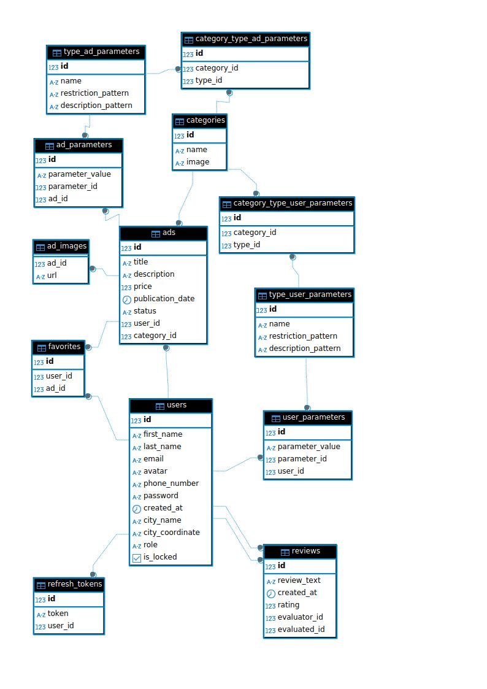

# Team Challenge marketplace project Bazario
## Project Summary
Development of a Bazario website that allows users to sell and
buy goods. The main features include creating ads, viewing 
seller contacts, and convenient tools for searching and 
sorting products.
## Scope
- User registration and authorization
- Adding, editing and deleting ads
- Uploading product images
- Displaying seller contact information
- Searching by ad title
- Sorting by price and date
- Pagination (page numbering)
- Adding ads to favorites
## Backend features
The open-api documentation is independent and described in 
[openapi-doc](./src/main/resources/swagger/openapi-doc.yaml). 
Endpoints, dto, and enum are generated according to this 
documentation.

Files are uploaded to the remote service one at a time to avoid 
losses under heavy loads. However, you need to bind them to the
file owner, so you first create the owner (ad, category, user) 
and then upload the files.

The announcement has a status. 
The NEW status is required to create a new ad without data for 
linking files. Such an announcement is issued one per user and 
will be returned when requested to create a new announcement 
until the status changes. 
The ACTIVE status allows you to display ads for other users and 
add them to your favorites. 
The DISABLE status is available only to the ad owner and
administration. 
The DELETE status is available only to the administration.

Ads are filtered by the endpoint with the address: 
/public/ads and the filters parameter, which contains pagination,
filter fields (by the user field we filter users by: id, rating, 
distance), ad and user parameter fields.

Store the state of the refresh token so that there is one valid 
token per user.
## Diagram database

## Install instruction
To use the program, you must have
- an account on the website https://cloudinary.com. Fill in the parameters CLOUDINARY_NAME, CLOUDINARY_KEY, CLOUDINARY_SECRET
- The PostgeSQL database is local or remote. Fill in the parameters POSTGRES_DB_URL, POSTGRES_USER, POSTGRES_ROOT_PASSWORD
- Redis database for cache local or remote. Fill in the parameters REDIS_HOST, REDIS_USERNAME, REDIS_PORT, REDIS_PASSWORD
- Mail service for sending messages. Fill in the parameters MAILTRAP_HOST, MAILTRAP_PORT, MAILTRAP_USERNAME, MAILTRAP_PASSWORD
- Google account and the application registered in Google.Console for authorization via Google. Fill in the parameters 
GOOGLE_CLIENT_ID, GOOGLE_CLIENT_SECRET
- Generate an AES-256 key for password encryption. Fill in the AES_SECRET parameter
- Generate a 64-bit JWT secret. Fill in the parameters JWT_EXPIRATION (in milliseconds for access token), JWT_REFRESH_EXPIRATION
(in milliseconds for refresh token), JWT_SECRET

For local use, we recommend using openjdk-23 and running the command first: `mvn clear complile`